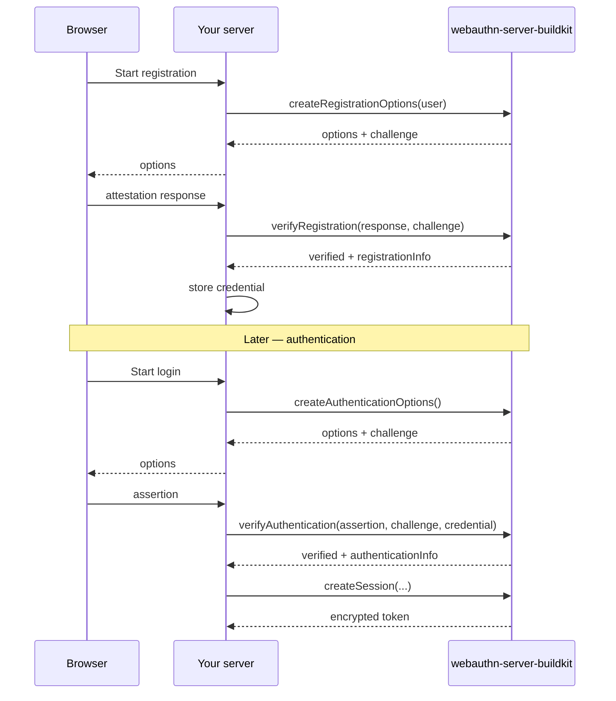

# Quick Start

**This guide takes you through a full WebAuthn round trip — register a passkey, then authenticate with it — using webauthn-server-buildkit on the server.** It assumes a browser front end calls `navigator.credentials.create()` and `.get()`; this page focuses on the four server methods you wire those calls to.

A WebAuthn ceremony always has two halves: the server **generates options** (with a challenge), and later the server **verifies the response** the authenticator produced for that challenge.

## 1. Create the server

```typescript
import { WebAuthnServer, MemoryStorageAdapter } from 'webauthn-server-buildkit';

export const webauthn = new WebAuthnServer({
  rpName: 'My App',
  rpID: 'example.com',
  origin: 'https://example.com',
  encryptionSecret: process.env.WEBAUTHN_SECRET!, // >= 32 chars
  storageAdapter: new MemoryStorageAdapter(), // swap for a real adapter in prod
});
```

The `MemoryStorageAdapter` keeps users, credentials, challenges, and sessions in process memory — perfect for trying things out. For production, implement the [`StorageAdapter` interface](../guides/storage-adapters.md).

## 2. Registration — generate options

When a signed-in user wants to add a passkey, generate creation options and send them to the browser. Persist the returned `webAuthnUserId` on the credential record so usernameless login works later.

```typescript
const user = { id: 'user-123', username: 'alice@example.com', displayName: 'Alice' };

const { options, challenge, webAuthnUserId } = await webauthn.createRegistrationOptions(user);

// Send `options` to the browser for navigator.credentials.create({ publicKey: options }).
// Keep `challenge` (and `webAuthnUserId`) associated with this user's session.
```

## 3. Registration — verify the response

The browser returns a `RegistrationCredentialJSON`. Verify it against the challenge you issued, then store the credential.

```typescript
const { verified, registrationInfo } = await webauthn.verifyRegistration(
  responseFromBrowser,
  challenge,
);

if (verified && registrationInfo) {
  await webauthn.getStorageAdapter()!.credentials.create({
    id: registrationInfo.credential.id,
    publicKey: registrationInfo.credential.publicKey,
    counter: registrationInfo.credential.counter,
    transports: registrationInfo.credential.transports,
    alg: registrationInfo.credential.alg, // pin the algorithm at auth time
    deviceType: registrationInfo.credentialDeviceType,
    backedUp: registrationInfo.credentialBackedUp,
    userVerified: registrationInfo.userVerified,
    userId: user.id,
    webAuthnUserID: webAuthnUserId,
  });
}
```

When a `storageAdapter` is configured, the challenge is consumed once and cannot be replayed — this is on by default (`enforceChallengeStore`).

## 4. Authentication — generate options

```typescript
const { options, challenge } = await webauthn.createAuthenticationOptions();

// Send `options` to the browser for navigator.credentials.get({ publicKey: options }).
// Keep `challenge` associated with this login attempt.
```

## 5. Authentication — verify the assertion

Look up the stored credential by its ID, then verify. On success the library updates the stored signature counter and `lastUsedAt` for you.

```typescript
const credential = await webauthn.getStorageAdapter()!.credentials.findById(assertion.id);
if (!credential) throw new Error('Unknown credential');

const { verified, authenticationInfo } = await webauthn.verifyAuthentication(
  assertion,
  challenge,
  credential,
);

if (verified) {
  // Optionally mint an encrypted session token:
  const token = await webauthn.createSession(
    credential.userId,
    credential.id,
    authenticationInfo!.userVerified,
  );
  // Return `token` to the client (cookie / Authorization header).
}
```

## 6. Validate sessions on later requests

```typescript
const { valid, sessionData } = await webauthn.validateSession(token);
if (valid) {
  // sessionData.userId is authenticated
}
```

## The whole flow at a glance



## Next steps

- [Registration guide](../guides/registration.md) — options, `excludeCredentials`, and duplicate prevention.
- [Authentication guide](../guides/authentication.md) — counters, downgrade advisories, and discoverable credentials.
- [Sessions guide](../guides/sessions.md) — token lifecycle and revocation.
- [Storage adapters](../guides/storage-adapters.md) — implement a production adapter.
